Pharmasio.com

Pharmasio.com is a website that provides a comprehensive catalog of health and wellness products, including prescription and over-the-counter medications, personal care items, and medical supplies. Our mission is to provide convenient and accessible healthcare solutions to our customers, with a focus on quality and affordability. We also Provide best solutions to our Users to Solve there medical Problems By keeping trace Of there everyday Neutrition and Helth data.
We also Provide Dorestep Dilivelry of All Fruiuts and Vegitables. With Quality and Afofordability.

## Technologies Used

- HTML,CSS,ReactJs,Redux,ChakraUI For Frontend
- Nodejs,Express For Backend.
- MongoDB For Database

## Flow of the website

### Home Page

On the Home Page, we Provided Links for all Pages Linke Medicine Page, Labtest Page, Login Page, and Signup page also if the user logged in then the user can access the account Page.
we also provided Informative Sliders on the home page to describe our offers and all. in the bottom section of the home page use can directly upload their Prescription so he doesn't have to search for each product on our website
acording to his need.
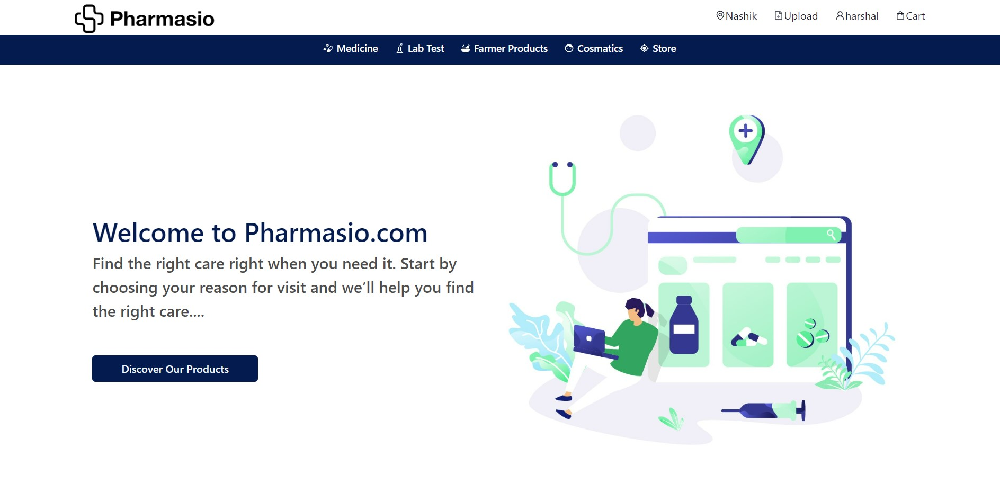
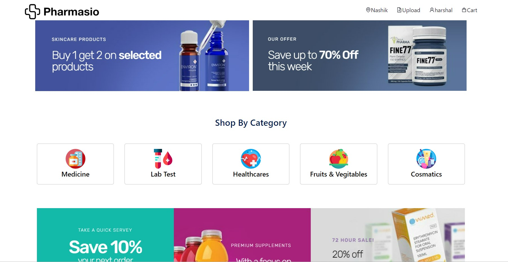

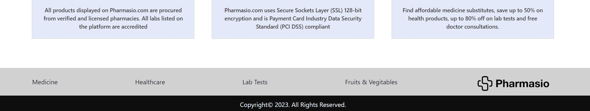

### Login and Signup Page

On this Page User can Loin with his Credentials fro accessing the website. If the user doesn't have credentials hi has to create an account on the signup page.

### User acount Page
On this Page, the user can Update his credentials, and user can access his all order and Logout Button.
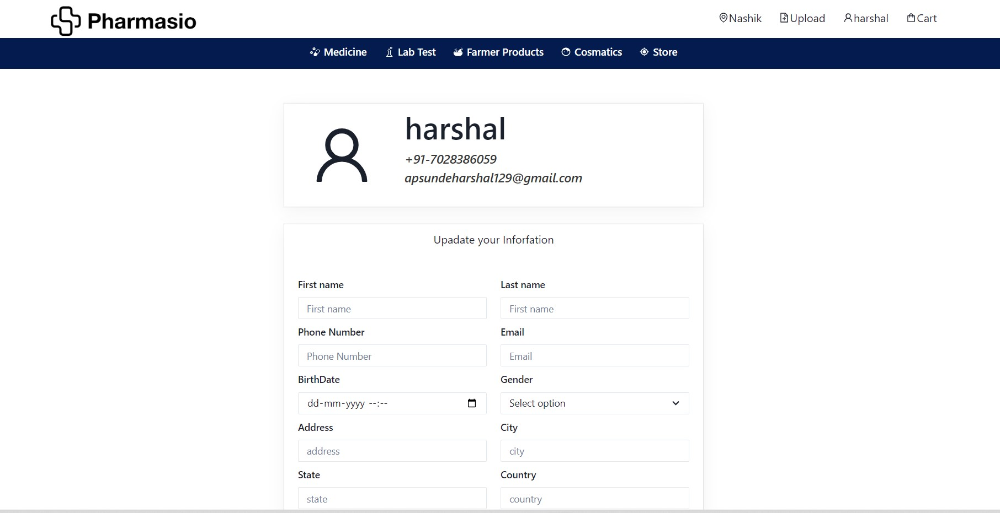
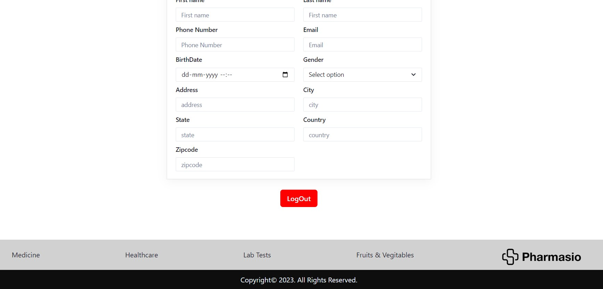

### Medicine Page

On this Page, users can access all Drugs prescribed by Doctors. But by the Government Rules hi can only buy OTC drugs from here if the user wants to but for non-OTC drugs hi must have to upload his Prescription for this after the Prescription is uploaded then we verify it by a registered Pharmacist.
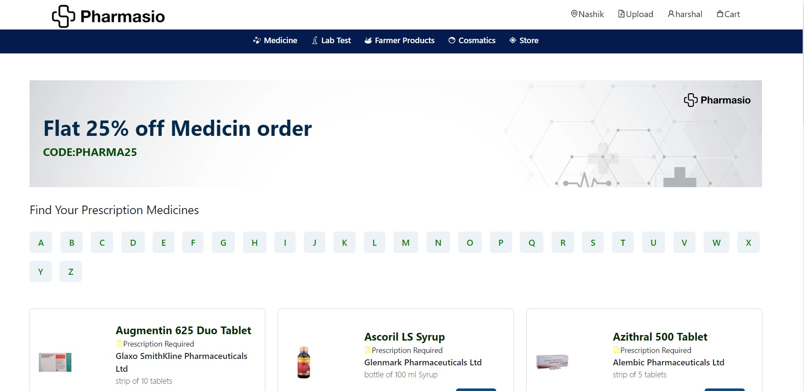
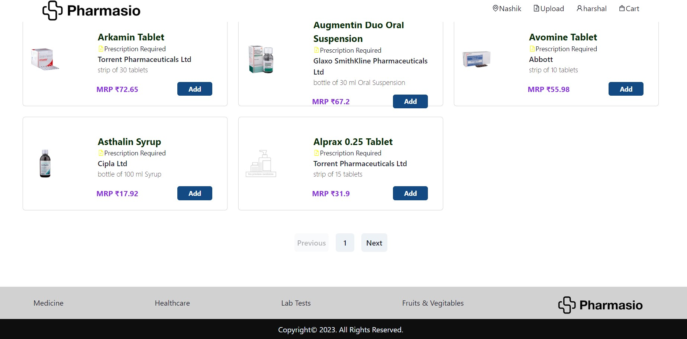
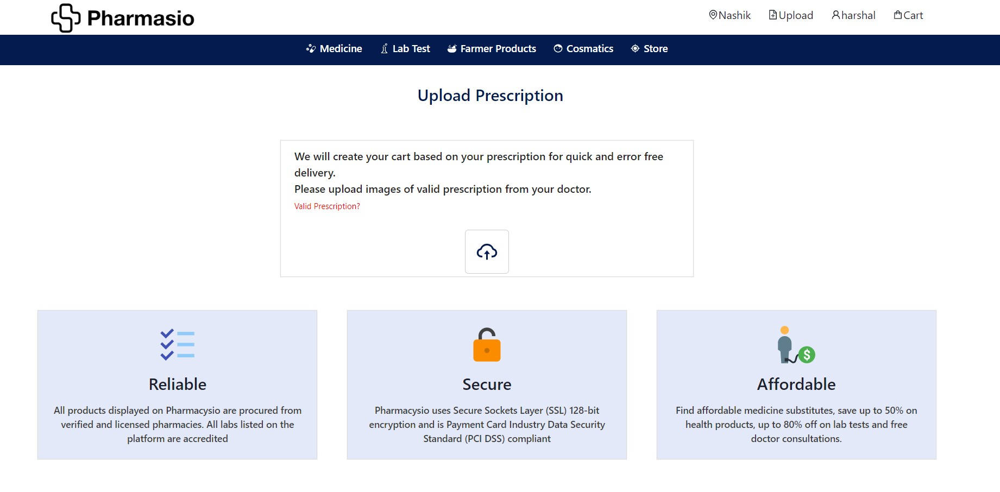

### Lab test Page
On this Page, we Provided functionality to directly book lab tests by adding NAme and contact no so our Lab partner directly calls you for further confirmation or the user can also Book a test by selecting by himself fro a given different test on this page.
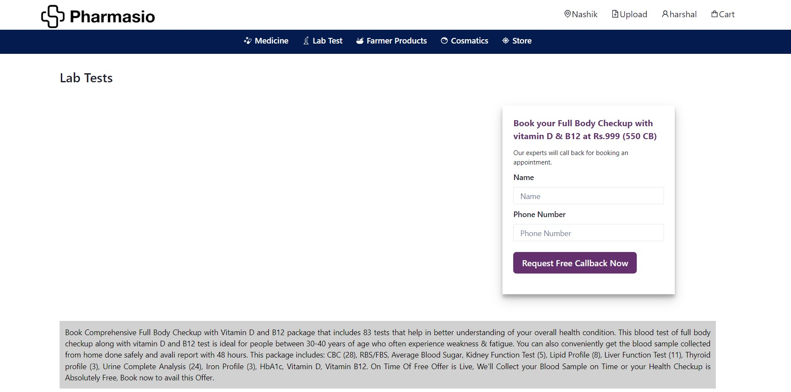
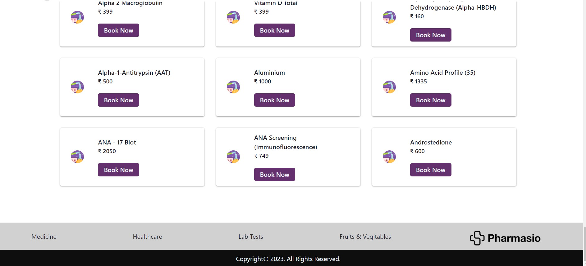

### Other Product  Page
 On this Page, Users can access all categories related to non-OTC drugs, Pharmaceutical Products, and Ayurvedic products. we also provide sorting, Filtering functionality here for searching different products.
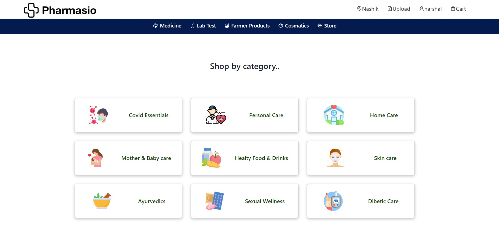
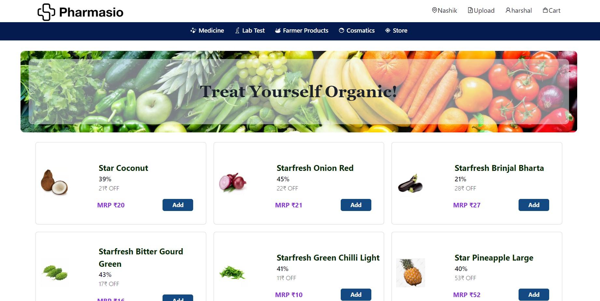
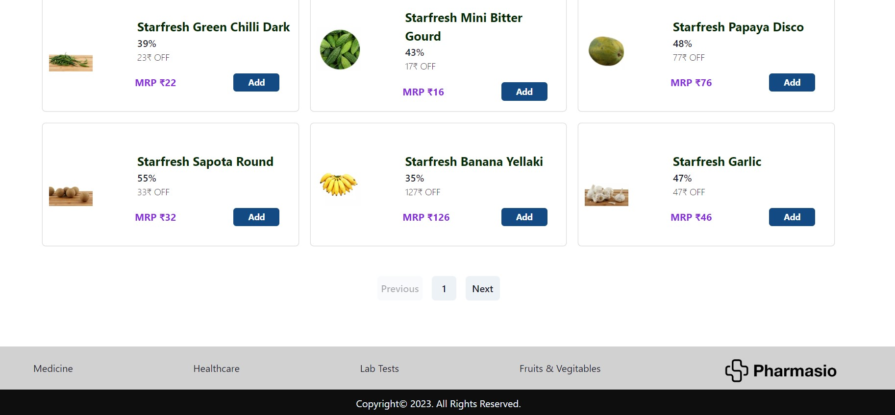

### Cart Page

On this Page, the User can access all Products that hi added to the cart also user can remove any product from the cart also.
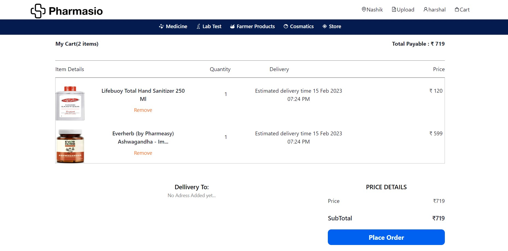

### Payment Page
clicks on the checkout securely button on the cart page. The user needs to fill in his account details and then after clicking on submit my order button. here we Provide all Payment options. So users can checkout easily. 
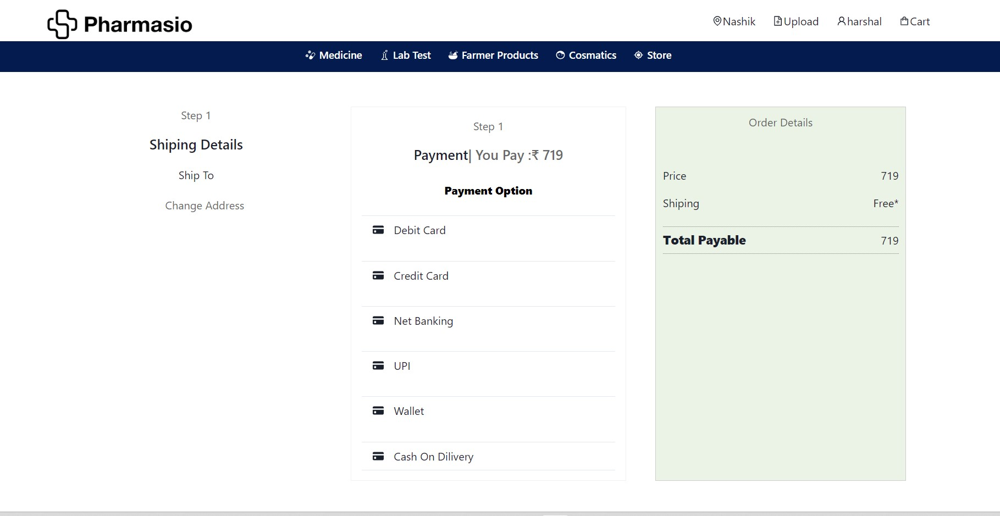

# Getting Started with Create React App

This project was bootstrapped with [Create React App](https://github.com/facebook/create-react-app).

## Available Scripts

In the project directory, you can run:

### `npm start`

Runs the app in the development mode.\
Open [http://localhost:3000](http://localhost:3000) to view it in your browser.

The page will reload when you make changes.\
You may also see any lint errors in the console.

### `npm run build`

Builds the app for production to the `build` folder.\
It correctly bundles React in production mode and optimizes the build for the best performance.

The build is minified and the filenames include the hashes.\
Your app is ready to be deployed!

See the section about [deployment](https://facebook.github.io/create-react-app/docs/deployment) for more information.

### `npm run eject`

##License

Pharmasio.com is under the MIT License See LICENSE for More Information
